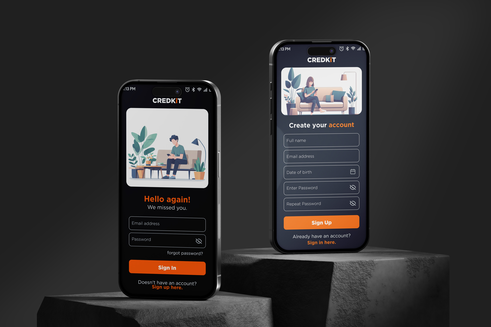

# CREDKiT Lender

Credkit is a revolutionary financial app for Android and iOS that cuts out the middleman. By leveraging blockchain technology, Credkit creates a secure peer-to-peer lending marketplace. Borrowers can directly connect with lenders, bypassing traditional banks and their fees.  Smart contracts, automated agreements on the blockchain, ensure secure transactions and repayment.  Users have the freedom to negotiate loan terms, including interest rates and durations, creating a more flexible and potentially more affordable borrowing experience. 

## Features

- Post requests with preferred conditions.
- Accept offers which are convenient.
- Post offers with preferred conditions.
- Fast fund release.
- No physical documentation or liability.

## Installation

1. Clone the repository: `git clone https://github.com/adarshcm10/credkit_lender.git`

2. Open the project in your preferred development environment (e.g., Android Studio, Visual Studio Code).

3. Build and run the app on your preferred device or emulator.

## Contributing

Contributions are welcome! If you find any issues or want to add new features to the app, feel free to submit a pull request. Please make sure to follow the project's code style and guidelines.

## License

This project is licensed under the [MIT License](LICENSE.md).
